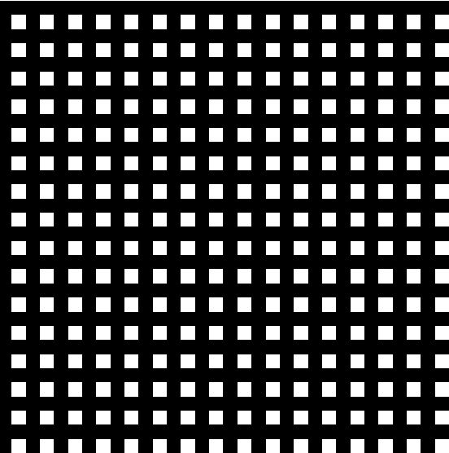

# Documentation for Assignment 1

This is a template for documenting your assignment. Feel free to use the structure below, add/remove section, or re-organize the order to explain your project.

## Table of Contents

- [Pseudo-Code](#pseudo-code)
- [Technical Explanation](#technical-explanation)
- [Results](#results)
- [References](#references)

---

## Pseudo-Code

*(Provide step-by-step pseudo-code explaining the logic of your program. This should be detailed enough to understand your approach without reading the actual code.)*

Example:

1. **Initialize Variables**
   - Set canvas dimensions (height and width).
   - Define color values.

2. **Create Blank Canvas**
   - Initialize a 2D NumPy array filled with zeros.

3. **Generate Pattern**
   - **For** each row in the canvas:
     - **If** row number is even:
       - Assign a specific color value to that row.
     - **Else**:
       - Assign a different color value.

4. **Introduce Randomness**
   - Generate a random matrix of the same size.
   - Add the random matrix to the canvas to create noise.

5. **Add RGB Channels**
   - Stack the 2D array into a 3D array to represent RGB channels.

6. **Assign Colors to Channels**
   - Modify specific channels to change colors in the pattern.

7. **Visualize and Save Image**
   - Use Matplotlib to display the image.
   - Save the image to the `images/` folder.

*(Feel free to adjust or expand upon this template based on your implementation.)*

---

## Technical Explanation

*(Provide a concise explanation, maximum 300 words, of the array manipulations and transformations you've implemented. Discuss how the defined parameters and adopted algorithms contribute to the final pattern.)*

Example:

In this assignment, I began by initializing a blank canvas using `np.zeros()`, which created a 2D array representing the image pixels. To create a striped pattern, I used slicing to assign color values to every other row. Specifically, `canvas[::2, :] = 100` assigns a color value to every even row.

To introduce randomness, I utilized `np.random.randint(0, 50, (height, width))` to create a noise matrix and added it to the canvas. This added subtle variations to the pattern, making it more visually interesting.

Converting the 2D canvas into a 3D array was done using `np.stack()` to add RGB channels. I then manipulated individual channels to assign different colors. For instance, setting `canvas_rgb[:, :, 0]` to a higher value increased the red intensity in the pattern.

Finally, I used Matplotlib's `imshow()` function to display the image and `savefig()` to save it. Ensuring the data types and value ranges were correct was crucial for accurate color representation.

*(Ensure your explanation covers your specific implementation details.)*

---

## Results

*(Include any visual aids such as flowcharts, diagrams, or images that help explain your process. You can insert images stored in the `images/` folder.)*

Example:

```markdown

```


---

## References

*(List any resources, tutorials, or documentation you referred to while completing the assignment.)*

Example:

- NumPy Documentation: [Array Manipulation Routines](https://numpy.org/doc/stable/reference/routines.array-manipulation.html)

---