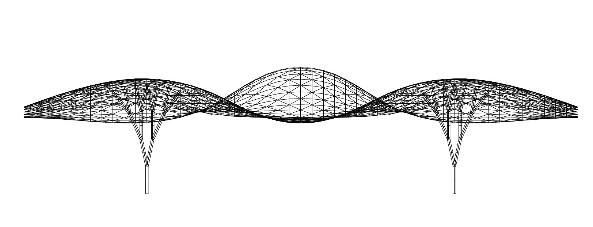

# Assignment 3: Parametric Structural Canopy Documentation

## Table of Contents

- [Pseudo-Code](#pseudo-code)
- [Technical Explanation](#technical-explanation)
- [Design Variations](#design-variations)
- [Challenges and Solutions](#challenges-and-solutions)
- [References and AI Acknowledgments](#references-and-ai-acknowledgments)

---

## Pseudo-Code

*(Provide detailed pseudo-code explaining the logic of your program. Outline your functions for depth map generation, recursive geometry, and tessellation, and how they contribute to the final structural canopy.)*

```python
# 0. Prepare Inputs.

base_surface  # optional: an existing NURBS surface to sample (can be None)
divU, divV    # sampling resolution
amplitude, frequency, phase  # heightmap controls
rec_depth, br_length, len_reduct, n_branches  # branching controls
seed          # random seed


# 1. Set random seeds for reproducibility.

seed_everything(seed)


# 2. Build UV Grids — create uniform U,V samples for evaluation.

U, V = uv_grid(divU, divV)


# 3. Compute Heightmap — produce a scalar field H over U,V that will drive displacement.

H = heightmap(U, V, amplitude=amplitude, frequency=frequency, phase=phase)


# 4. Create Source Point Grid — either make a planar XY grid
#    OR sample an existing surface.

# P_src = make_point_grid_xy(divU, divV, origin=(0,0,0), size=(10,10))
P_src = sample_point_grid_from_surface(base_surface, U, V)


# 5. Deform Points with Heightmap — either offset along Z for planar grids
#    OR along surface normals for sampled grids.

#P_def = manipulate_points_z(P_src, H)
P_def = manipulate_points_along_normals(P_src, H, base_surface, U, V)


# 6. Construct Canopy Surface — build a NURBS surface from the deformed point grid.

surf = surface_from_point_grid(P_def)


# 7. Uniformly Sample the Surface — generate a regular point grid on the new surface for panelization.

Sgrid = sample_surface_uniform(surf, divU, divV)


# 8. Tessellate into Panels — convert each cell of `Sgrid` into two 3‑point NURBS panels.

panels = tessellate_panels_from_grid(Sgrid)


# 9. Choose Support Anchors — pick anchor points such as bounding‑box corners or custom points.

roots = bbox_corners(surf)


# 10. Generate Supports — grow a simple branching structure from the anchors using recursive rules.

supports = generate_supports(
    roots,
    depth=rec_depth,
    length=br_length,
    length_reduction=len_reduct,
    n_children=n_branches,
    seed=seed,
)


# 11. Set Component Outputs

out_surface      = surf
out_tessellation = panels
out_supports     = supports
```

#### `heightmap(U, V, ...)`
**Description**: Define a scalar field over UV that controls vertical/normal displacements.

**Inputs**: U (2D grid), V (2D grid), parameters (e.g., amplitude, frequency, phase).

**Outputs**: H (2D array) same shape as U,V.

**Assumptions**: U,V are normalized to [0,1]. Parameters are numeric.

```text
Start with an empty 2D array H with same dimensions as U,V.
For each cell (i,j):
  Read u = U[i,j], v = V[i,j].
  Evaluate one or more smooth functions to compute h (e.g., waves, bumps, noise).
  Store h in H[i,j].
Return H.
```

---

#### `manipulate_points_z(point_grid, H)`
**Description**: Deform a planar point grid by lifting points along +Z using H.

**Inputs**: point_grid (2D list of 3D points), H (2D array, same indexing).

**Outputs**: P_def (deformed point_grid).

**Assumptions**: point_grid and H have identical row/column counts.

**Pseudocode**:
```text
Initialize an empty grid P_def.
For each cell (i,j):
  Read point p from point_grid[i,j] and height h from H[i,j].
  Create p' by adding h along the Z axis to p.
  Store p' into P_def[i,j].
Return P_def.
```


---

#### `manipulate_points_along_normals(point_grid, H, surface, U, V)`
**Description**: Deform a surface‑sampled grid by offsetting along local surface normals.

**Inputs**: point_grid (2D list of points sampled from surface), H (2D array), surface (NURBS surface id), U,V (the same UV grids used during sampling).

**Outputs**: P_def (deformed point_grid).

**Assumptions**: U,V map 1:1 to point_grid indices; surface is valid; normals are well‑defined.

**Pseudocode**:
```text
Query the surface domains in U and V to map unit UV → surface UV.
Initialize an empty grid P_def.
For each cell (i,j):
  Map (U[i,j], V[i,j]) into real surface parameters (u,v).
  Evaluate the surface normal n at (u,v).
  Read height h = H[i,j] and point p = point_grid[i,j].
  Create p' by moving p by h units in direction n.
  Store p' in P_def[i,j].
Return P_def.
```

---

#### `surface_from_point_grid(point_grid)`
**Description**: Build a single continuous NURBS surface from a rectangular point grid.

**Inputs**: point_grid (2D rectangular array of points).

**Outputs**: surf (surface identifier) or null on failure.

**Assumptions**: Grid is rectangular and ordered row‑major; points are reasonably regular.

**Pseudocode**:
```text
Validate grid dimensions (rows ≥ 2, cols ≥ 2).
Flatten the points in row‑major order.
Call the surface creation routine that fits a surface through the grid of points.
Return the created surface id (or null if the operation fails).
```

---

#### `tessellate_panels_from_grid(point_grid)`
**Description**: Convert a sampled point grid into a set of small panels.

**Inputs**: point_grid (2D array of points, e.g., from uniform surface sampling).

**Outputs**: panels (list of panel identifiers), where each panel is a 3‑point NURBS surface.

**Assumptions**: Neighboring cells form quads with points (i,j),(i,j+1),(i+1,j),(i+1,j+1).

**Pseudocode**:
```text
Initialize an empty list panels.
For each interior cell (i from 0..rows‑2, j from 0..cols‑2):
  Collect the four corner points: a,b,c,d.
  Create two triangular panels using corners (a,b,d) and (a,d,c).
  Append created panels to the list.
Return panels.
```

---

#### `generate_supports(roots, ...)`
**Description**: Generate a branching support structure starting at anchor points.

**Inputs**: roots (list of anchor points), parameters (depth, initial length, reduction, children count, randomness seed, etc.).

**Outputs**: supports (list of curve identifiers).
**Assumptions**: Root points are valid; recursion depth is non‑negative.

**Pseudocode**:
```text
Initialize an empty list supports.
Define a recursive procedure BRANCH(point, remaining_depth):
  If remaining_depth == 0 → stop.
  Compute an endpoint by extending from point by a length that may reduce each level (e.g., mostly upward, with small lateral jitter).
  Create a segment from point to endpoint and record it in supports.
  For each child in the specified number of branches:
    Optionally jitter the endpoint to form a new start.
    Call BRANCH(child_point, remaining_depth − 1).
For each root in roots: call BRANCH(root, depth).
Return supports.
```

---

## Technical Explanation

*(Provide a concise explanation of your code, focusing on how you implemented depth map manipulation, recursive geometry generation, and surface tessellation in Grasshopper Python. Discuss how your approach generates the final structural canopy and the mathematical principles involved.)*

1. **Heightmap Generation**
   - Describe how you compute a 2D height field using NumPy (or other methods).
   - Mention control parameters (e.g., amplitude, frequency).
   - Reference: `heightmap(U, V, ...)`

2. **Point Grid Creation**
   - Option A: Create a planar XY grid.
   - Option B: Sample an existing geometry/surface.
   - Reference: `make_point_grid_xy(...)` or `sample_point_grid_from_surface(...)`

3. **Point Grid Manipulation**
   - Option A: Offset points along Z-axis.
   - Option B: Offset along surface normals.
   - Reference: `manipulate_points_z(...)` or `manipulate_points_along_normals(...)`

4. **Surface Construction**
   - Describe how a NURBS surface is created from modified points.
   - Reference: `surface_from_point_grid(...)`

5. **Tessellation**
   - Explain how the surface or point grid is tessellated.
   - Reference: `tessellate_panels_from_grid(...)`

6. **Support Structure Generation**
   - Outline your branching or recursive geometry method.
   - Reference: `generate_supports(...)`


---

## Design Variations

*(Include images and descriptions of your generated design variations. For each category, provide at least three variations and discuss the differences and design decisions.)*

### Parameter Tables
*(Provide the exact parameter sets and seeds used for each design. Add or remove columns to reflect your implementation.)*

| Design | amplitude | frequency | phase | divU | divV | rec_depth | br_length | len_reduct | n_branches | seed |
|-------:|----------:|----------:|------:|-----:|-----:|----------:|----------:|-----------:|-----------:|-----:|
| A      |           |           |       |      |      |           |           |            |            |      |
| B      |           |           |       |      |      |           |           |            |            |      |
| C      |           |           |       |      |      |           |           |            |            |      |

> If you vary algorithms (e.g., quad vs. tri tessellation, heightmap function swap), note that explicitly in an **Algorithm Notes** column or footnote.

1. **Variation A: [Name/Description]**

   

   - **Parameters**:
     - `control_value`: [Value]
     - Other relevant parameters.

2. **Variation B: [Name/Description]**

   

   - **Parameters**:
     - `control_value`: [Value]
     - Other relevant parameters.

3. **Variation C: [Name/Description]**

   

   - **Parameters**:
     - `control_value`: [Value]
     - Other relevant parameters.

*(Repeat for Surface Tessellation Pattern and Vertical Supports.)*

---

## Challenges and Solutions

*(Discuss any challenges you faced during the assignment and how you overcame them.)*

### Examples:

- **Degenerate normals near trims**: clamp offsets or skip samples where the normal magnitude is near zero.
- **Self‑intersections at high amplitude**: limit amplitude to below the minimum radius of curvature of the base surface or add a collision check before displacement.
- **Excessive panel distortion**: increase `divU/divV` or switch tessellation strategy (quad ↔ tri) to maintain aspect ratios.
- **Branch attachment misses canopy**: project endpoints to the canopy (mesh or Brep) and truncate the final segment if no intersection is found.

---

## References and AI Acknowledgments

*(List any resources you used or found helpful during the assignment.)*

- **Python for CAD Applications**:
  - Rhino.Python Guides
  - RhinoScriptSyntax Documentation

- **Grasshopper and GhPython**:
  - Grasshopper Primer
  - GhPython Tutorials

- **Mathematical Functions and Recursion**:
  - Python Math Module
  - Recursion in Python Tutorials

- **Surface Tessellation Techniques**:
  - Voronoi Diagrams
  - Delaunay Triangulation

---

*(Feel free to expand upon these sections to fully capture your work and learning process.)*